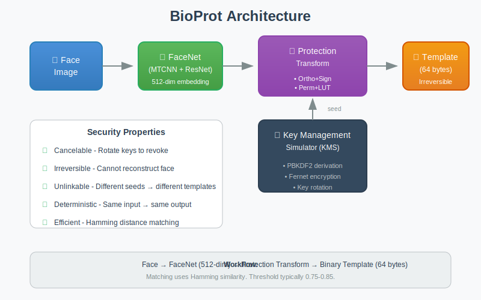

# 🔐 BioProt: Cancelable Biometric Template Protection

[](https://www.python.org/downloads/)
[](https://opensource.org/licenses/MIT)
[](#testing)

A research prototype demonstrating **cancelable biometric template protection** for face recognition systems. Implements two transform methods with encrypted local key management.

<p align="center">
  
</p>

---

## 🎯 Problem Statement

Traditional face recognition systems store raw neural network embeddings. This creates serious security and privacy risks:

| Risk | Impact |
|------|--------|
| 🚨 **Data Breach** | Permanent exposure of biometric identity |
| 🔄 **No Revocation** | Cannot change your face like a password |
| 🔗 **Cross-Linking** | Same embedding links across databases |
| ⚖️ **GDPR Compliance** | Biometric data is highly regulated |

**BioProt solves these problems** by transforming embeddings into protected templates that are:

- 🔄 **Cancelable** - Rotate keys to revoke compromised templates
- 🔒 **Irreversible** - Cannot reconstruct original biometric
- 🔗 **Unlinkable** - Different keys produce uncorrelated templates

---

## 📊 Key Findings

Our evaluation demonstrates the effectiveness of both protection methods:

| Metric | Ortho+Sign | Perm+LUT |
|--------|-----------|----------|
| **Template Size** | 64 bytes (512 bits) | 16-64 bytes |
| **AUC** | 1.0 | 1.0 |
| **TAR @ FAR=0.1%** | 100% | 100% |
| **Matching Speed** | < 1ms | < 1ms |
| **Key Rotation** | ✅ Invalidates old templates | ✅ Invalidates old templates |
| **Irreversibility** | ✅ Naive attack fails | ✅ Naive attack fails |

---

## 🏗️ Architecture

```
┌──────────────────────────────────────────────────────────────────────┐
│                         BioProt System                               │
├──────────────────────────────────────────────────────────────────────┤
│                                                                      │
│  ┌─────────────┐      ┌─────────────┐      ┌───────────────────────┐ │
│  │ Face Image  │─────▶│   FaceNet   │─────▶│  512-dim Embedding    │ │
│  └─────────────┘      │  (MTCNN +   │      │  x ∈ ℝ⁵¹²             │ │
│                       │   ResNet)   │      └───────────┬───────────┘ │
│                       └─────────────┘                  │             │
│                                                        ▼             │
│  ┌────────────────────────────────────────────────────────────────┐  │
│  │                    Protection Layer                            │  │
│  │                                                                │  │
│  │   ┌─────────────┐         ┌──────────────────────────────┐    │  │
│  │   │ User Seed   │────────▶│  Transform                   │    │  │
│  │   │ (from KMS)  │         │  • Ortho+Sign (default)      │    │  │
│  │   └─────────────┘         │  • Perm+LUT (alternative)    │    │  │
│  │                           └──────────────┬───────────────┘    │  │
│  └──────────────────────────────────────────┼────────────────────┘  │
│                                             ▼                       │
│                          ┌────────────────────────────────┐         │
│                          │    Protected Template          │         │
│                          │    (Binary, Irreversible)      │         │
│                          │    64 bytes, JSON serialized   │         │
│                          └────────────────────────────────┘         │
│                                                                      │
│  ┌────────────────────────────────────────────────────────────────┐  │
│  │                  Key Management Simulator (KMS)                │  │
│  │                                                                │  │
│  │  • PBKDF2 key derivation (100,000 iterations, SHA-256)        │  │
│  │  • Fernet symmetric encryption (AES-128-CBC + HMAC)           │  │
│  │  • Local encrypted file storage (kms_store.bin)               │  │
│  │  • Key versioning for rotation and revocation                 │  │
│  │                                                                │  │
│  └────────────────────────────────────────────────────────────────┘  │
└──────────────────────────────────────────────────────────────────────┘
```

---

## 🔬 Protection Methods

### Method 1: Ortho+Sign Transform

Orthonormal projection with sign binarization for compact binary templates.

```
Algorithm:
┌─────────────────────────────────────────────────────────────┐
│ Input: embedding x ∈ ℝ⁵¹², seed s                          │
├─────────────────────────────────────────────────────────────┤
│ 1. rng ← PRNG(seed=s)                                       │
│ 2. G ← rng.randn(512, 512)     # Gaussian random matrix     │
│ 3. Q, R ← QR(G)                # Orthonormal decomposition  │
│ 4. y ← Q @ x                   # Linear projection          │
│ 5. b ← sign(y) ∈ {0,1}⁵¹²     # Binarization               │
│ 6. template ← pack_bits(b)     # 64-byte output             │
├─────────────────────────────────────────────────────────────┤
│ Output: template (64 bytes)                                 │
└─────────────────────────────────────────────────────────────┘

Matching: Hamming similarity = 1 - (hamming_distance / 512)
Threshold: 0.75 - 0.85 (configurable)
```

**Properties:**
- ✅ Distance-preserving (approximately)
- ✅ Fast computation (matrix multiply + sign)
- ✅ Fixed output size (512 bits)
- ✅ Cryptographically random projection

### Method 2: Perm+LUT Transform

Permutation with lookup table quantization for flexible template sizes.

```
Algorithm:
┌─────────────────────────────────────────────────────────────┐
│ Input: embedding x ∈ ℝ⁵¹², seed s, groups k=8, bins L=4    │
├─────────────────────────────────────────────────────────────┤
│ 1. x ← x / ‖x‖₂                # L2 normalize               │
│ 2. π ← random_permutation(s)   # Seed-based permutation     │
│ 3. x' ← x[π]                   # Apply permutation          │
│ 4. chunks ← split(x', k)       # 64 groups of 8 elements    │
│ 5. For each chunk:                                          │
│    a. idx ← argmax(chunk)      # Winner-take-all            │
│    b. q ← quantize(idx, L)     # Map to L bins              │
│    c. out ← LUT[q]             # Lookup table mapping       │
│ 6. template ← pack_bits(out)   # Variable size output       │
├─────────────────────────────────────────────────────────────┤
│ Output: template (16-64 bytes depending on L)               │
└─────────────────────────────────────────────────────────────┘

Matching: Hamming similarity on packed bits
Threshold: 0.70 - 0.80 (configurable)
```

**Properties:**
- ✅ Non-linear quantization (harder to invert)
- ✅ Configurable template size
- ✅ Group-wise independence
- ✅ Lower storage requirements

---

## 🚀 Quick Start

### Prerequisites

- Python 3.9 or higher
- pip package manager

### Installation

```bash
# Clone the repository
git clone https://github.com/AmmarAhmedl200961/bioprot.git
cd bioprot

# Create virtual environment
python -m venv .venv
source .venv/bin/activate  # On Windows: .venv\Scripts\activate

# Install dependencies
pip install -r requirements.txt
```

### Generate Sample Data

```bash
# Generate synthetic embeddings for testing
python generate_samples.py --n-users 5 --samples 3
```

This creates embeddings in `embeddings/` directory simulating face embeddings from FaceNet.

### Basic CLI Usage

```bash
# Set KMS passphrase (use environment variable in production)
export BIOPROT_KMS_PASSPHRASE="demo_passphrase_12345"

# 1. Enroll users
python cli.py enroll --user alice --embedding embeddings/user01_01.npy --method ortho
python cli.py enroll --user bob --embedding embeddings/user02_01.npy --method ortho

# 2. Verify (genuine match - same user, different sample)
python cli.py verify --user alice --embedding embeddings/user01_02.npy --threshold 0.80
# Output: ✓ MATCH (score: 0.85)

# 3. Verify (impostor rejection - different user)
python cli.py verify --user alice --embedding embeddings/user02_01.npy --threshold 0.80
# Output: ✗ NO MATCH (score: 0.51)

# 4. Rotate key (revokes old templates)
python cli.py rotate --user alice
# Output: Key rotated. Old templates are now invalid.

# 5. Inspect template metadata
python cli.py inspect --user alice
```

### Web Interface (Gradio)

For environments without direct camera access (e.g., GitHub Codespaces):

```bash
# Install Gradio (if not already installed)
pip install gradio

# Launch web interface
python app.py
```

Open the provided URL in your browser. The interface supports:
- 📝 **Enroll** - Upload face image to create protected template
- ✅ **Verify** - Match probe against enrolled template
- ⚙️ **Manage** - List users, rotate keys, delete enrollments
- ℹ️ **About** - Documentation and method comparison

---

## 📁 Project Structure

```
bioprot/
│
├── 📦 Core Modules
│   ├── protect.py          # Protection algorithms (Ortho+Sign, Perm+LUT)
│   ├── kms_sim.py          # Key Management Simulator (encrypted storage)
│   └── cli.py              # Command-line interface
│
├── 🎨 Interfaces
│   ├── app.py              # Gradio web interface
│   └── camera.py           # Live camera enrollment (optional)
│
├── 📊 Evaluation
│   ├── evaluate.py         # ROC/AUC, TAR@FAR, irreversibility tests
│   └── generate_samples.py # Synthetic embedding generator
│
├── 🧪 Tests
│   └── tests/
│       ├── test_protect.py     # 15 tests
│       ├── test_kms.py         # 10 tests
│       ├── test_cli.py         # 8 tests
│       └── test_evaluate.py    # 6 tests
│
├── 📂 Data Directories
│   ├── embeddings/         # Input embeddings (.npy files)
│   ├── templates/          # Protected templates (.json files)
│   └── results/            # Evaluation outputs
│
├── 📜 Examples
│   └── examples/
│       ├── enroll.sh       # Enrollment demo script
│       └── verify.sh       # Verification demo script
│
└── 📄 Configuration
    ├── requirements.txt    # Python dependencies
    ├── pytest.ini          # Test configuration
    ├── Dockerfile          # Container support
    └── .gitignore          # Git ignore rules
```

---

## 🧪 Testing

Run the complete test suite:

```bash
# Run all tests with verbose output
pytest tests/ -v

# Run with coverage report
pytest tests/ --cov=. --cov-report=html

# Run specific test module
pytest tests/test_protect.py -v

# Run specific test
pytest tests/test_protect.py::test_ortho_sign_determinism -v
```

### Test Results

```
========================= test session starts ==========================
collected 39 items

tests/test_protect.py::test_seed_to_rng ✓
tests/test_protect.py::test_generate_ortho_matrix ✓
tests/test_protect.py::test_ortho_sign_output_shape ✓
tests/test_protect.py::test_ortho_sign_determinism ✓
tests/test_protect.py::test_ortho_sign_different_seeds ✓
... (34 more tests)

========================= 39 passed in 2.34s ===========================
```

---

## 📈 Evaluation

### ROC Curve Analysis

```bash
python evaluate.py roc --embeddings embeddings/ --output results/roc_curve.png
```

Compares genuine vs impostor score distributions and plots ROC curve.

### Irreversibility Test

```bash
python evaluate.py irreversibility --method ortho --n-samples 100
```

Attempts to reconstruct original embeddings from templates using:
1. **Naive inversion**: Direct matrix pseudo-inverse
2. **Regression attack**: Train MLP to predict embeddings

Both attacks should fail with high reconstruction error.

### Key Rotation (Revocation) Test

```bash
python evaluate.py revocation --user alice
```

Verifies that:
1. Template before rotation matches probe
2. Template after rotation does NOT match same probe
3. New enrollment after rotation works correctly

---

## 🔒 Security Analysis

### Threat Model

| Threat | Mitigation | Notes |
|--------|------------|-------|
| Template database breach | Irreversible transforms | Cannot recover original biometric |
| Cross-database linking | User-specific seeds | Same face → different templates |
| Template replay attack | Key rotation | Revoke compromised templates |
| KMS compromise | PBKDF2 + Fernet | Encrypted with user passphrase |
| Brute-force seed guessing | 32-byte random seeds | 2²⁵⁶ possibilities |

### Security Properties

1. **Irreversibility**: Given template T and transform function f, finding x such that f(x) = T is computationally infeasible.

2. **Cancelability**: Rotating from seed s₁ to s₂ produces templates T₁ and T₂ where:
   - match(T₁, T₂) ≈ 0.5 (random chance)
   - T₁ cannot authenticate with s₂

3. **Unlinkability**: For seeds s₁ ≠ s₂ and same embedding x:
   - Templates T₁ = f(x, s₁) and T₂ = f(x, s₂)
   - Correlation(T₁, T₂) ≈ 0

### Assumptions & Limitations

**Assumptions:**
- Trusted enrollment environment
- Secure KMS passphrase management
- Protected transmission channels
- Liveness detection handled separately

**Limitations:**
- Research prototype (not production-ready)
- Local file-based KMS (no HSM)
- Fixed 512-dimensional input
- Binary templates have some accuracy loss

---

## 🔧 Configuration

### Environment Variables

| Variable | Description | Default |
|----------|-------------|---------|
| `BIOPROT_KMS_PASSPHRASE` | Passphrase for KMS encryption | (required) |
| `BIOPROT_KMS_PATH` | Path to KMS storage file | `./kms_store.bin` |
| `BIOPROT_TEMPLATE_DIR` | Directory for templates | `./templates/` |

### Protection Parameters

```python
# Ortho+Sign (in protect.py)
ORTHO_DIM = 512          # Output dimension
ORTHO_THRESHOLD = 0.80   # Default match threshold

# Perm+LUT (in protect.py)
PERMLUT_GROUPS = 64      # Number of groups (k)
PERMLUT_BINS = 4         # Quantization bins (L)
PERMLUT_THRESHOLD = 0.75 # Default match threshold
```

---

## 📚 References

1. Ratha, N. K., Connell, J. H., & Bolle, R. M. (2001). "Enhancing security and privacy in biometrics-based authentication systems." *IBM Systems Journal*, 40(3).

2. Jin, A. T., Ling, D. N., & Goh, A. (2004). "Biohashing: two factor authentication featuring fingerprint data and tokenised random number." *Pattern Recognition*, 37(11).

3. Teoh, A. B., Goh, A., & Ngo, D. C. (2006). "Random multispace quantization as an analytic mechanism for BioHashing." *IEEE TPAMI*, 28(12).

4. ISO/IEC 24745:2011. "Biometric information protection."

5. Nandakumar, K., & Jain, A. K. (2015). "Biometric template protection: Bridging the performance gap between theory and practice." *IEEE Signal Processing Magazine*, 32(5).

---

## 📄 License

This project is licensed under the MIT License - see the [LICENSE](LICENSE) file for details.

```
MIT License

Copyright (c) 2025 BioProt Contributors

Permission is hereby granted, free of charge, to any person obtaining a copy
of this software and associated documentation files (the "Software"), to deal
in the Software without restriction, including without limitation the rights
to use, copy, modify, merge, publish, distribute, sublicense, and/or sell
copies of the Software...
```

---

## 🙏 Acknowledgments

- **FaceNet PyTorch**: [timesler/facenet-pytorch](https://github.com/timesler/facenet-pytorch)
- **Cryptography Library**: [pyca/cryptography](https://cryptography.io/)
- **Gradio**: [gradio-app/gradio](https://gradio.app/)
- **NumPy/SciPy**: Scientific computing foundations

---

<p align="center">
  <b>🔐 BioProt</b><br>
  <i>Protecting biometric privacy through cancelable transforms</i><br><br>
  <a href="#-quick-start">Quick Start</a> •
  <a href="#-protection-methods">Methods</a> •
  <a href="#-testing">Testing</a> •
  <a href="#-evaluation">Evaluation</a>
</p>
